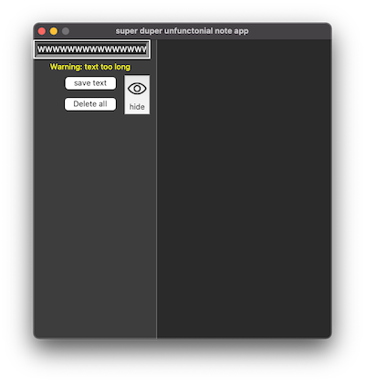

# tk-note-app
This is a simple Tkinter Note application not useful or something just... idk

Design with(kinda) SwiftUI 

optimized for MacOS not even sure if it works in windows 

**I would be greatful if someone tries in windows and gives me feed back**

Writin by: Taha Dagistanli :)

